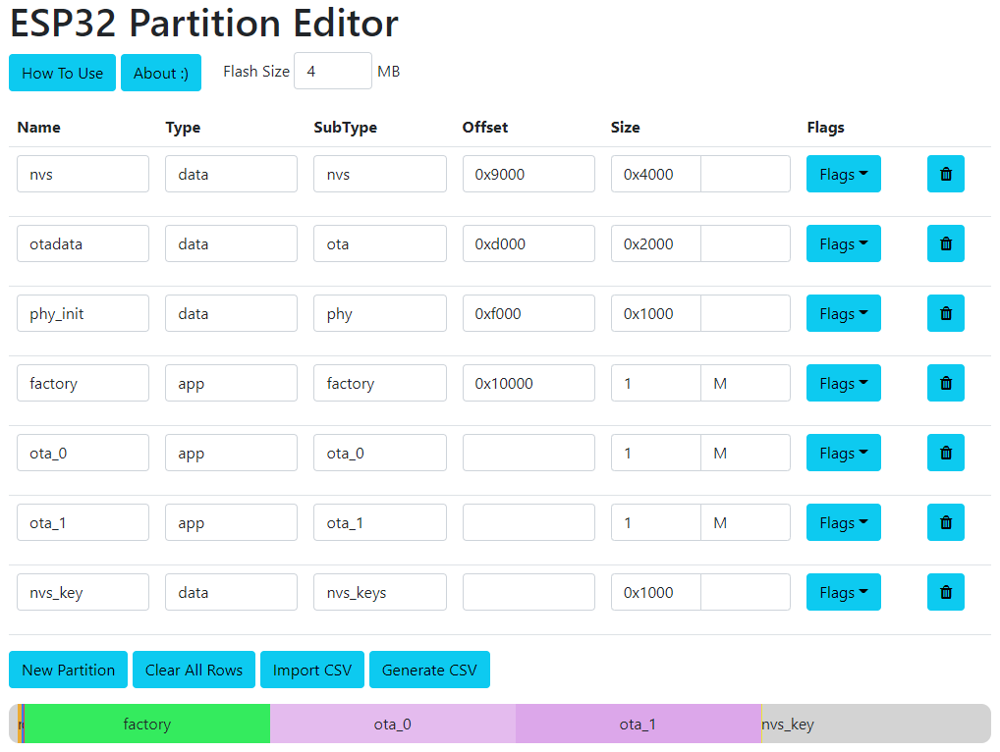

# ESP32 Partition Editor

This is a web tool for editing ESP32 Partition Tables.  It provides a friendly table thing for manually setting partition details, and a bar thing for graphically visualising and setting partition offsets and sizes (like in PC partition editors).

# Repository Structure
- `lib` stores any local libraries (although most dependancies are pulled from CDNs)
    - the main JS file, `partition_table.js` lives here
- `tests` a collection of partition table CSVs that I used to test the tool
- `index.html` is the main HTML for the tool
- `style.css` is the styling for the HTML